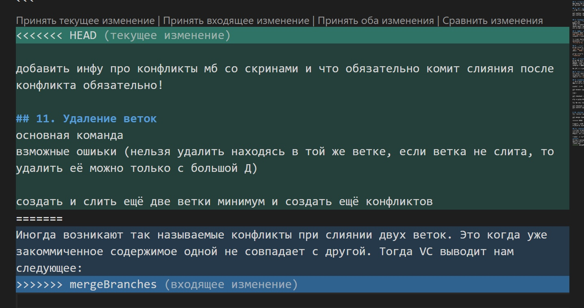

# Работа с Git и GitHub

## 1. Проверка: установлен ли Git
в терминале выполнить команду `git (--)version` (одна команда относится к git (другая к терминалу)). Если Git установлен, то выведется его версия, если нет - сообщение об ошибке. 

## 2. Установка Git
Загружаем последнюю версию Git с сайта https://git-scm.com/downloads и выполняем установку с настройками по умолчанию.

## 3. Настройка Git
При первом использовании Git необходимо представиться, выполнив две команды:
```
git config --global user.name «Ваше имя английскими буквами»
git config --global user.email ваша почта@example.com
```

## 4. Инициализация репозитория
Проверяем, что мы находимся в нужной папке. Пишем команду `git init`. В нашей папке Git
начал отслеживать все изменения. `git status` нужен для того, чтобы проверить, какие файлы на данный момент отслеживаются в нашем репозитории и, какие из них ещё не закоммичены.

## 5. Запись изменений в репозитории
Создадим файл в папке и добавим его в поле зрение гита с помощью команды `git add (название файла)`. Название файла поможет быстро написать кнопка Tab. Если никаких сообщений об ошибках нет - запись прошла успешно.

Мы можем фиксировать те
изменения, которые совершили. Для этого вызываем команду `git commit -m "Комментарий, который потом будет виден в истории коммитов"`. 

## 6. Просмотр истории коммитов
Чтобы вывести все коммиты с комментариями, которые мы сделали, введите команду `git log`. Это и будет список версий, к которым мы можем "откатываться", если нужно. `HEAD ->` указывает на ту версию, в которой мы сейчас нахдимся.

Чтобы вывести только комментарии ко всем сделанным коммитам: `git log --oneline`. 

## 7. Перемещение между сохранениями
Чтобы перейти к любой из предыдущих версий
файла, воспользуемся командой `git checkout (хэш-код нужного коммита)`. Можем указать либо код целиком, либо первые четыре символа. В этот момент файл, лежащий в папке, изменяется, и можно его даже скопировать и отправить.

Вернуться к актуальной версии - `git checkout master` или `git swith -`.

## 8. Игнорирование файлов
Для исключения из отслеживания в репозитории определённых файлов или папок, необходимо создать в нём файл *`.gitignore`* и записать в него их названия или шаблоны (*`*.png`*, *`*.txt`* и т.д.)

## 9. Создание веток в Git
По умолчанию имя основной ветки - *'master'*.
Список веток в репозитории можно посмотреть с помощью команды `git branch`.

Создать новую ветку можно командой:
```
git branch <название новой ветки>
```
Либо:
```
git checkout -b <название добавляемой ветки>
```
Эта команда удобнее тем, что сразу после создания переходит на новую ветку.

Для переключения между ветками используется одна из команд:
```
git checkout <название ветки>
git switch <название ветки>
```

# 10. Слияние веток и разрешение конфликтов
Для слияния некоторой ветки с текущей выполнить команду:
```
git merge <название добавляемой ветки>
```
Иногда возникают так называемые конфликты при слиянии двух веток. Это когда уже закоммиченное содержимое одной не совпадает с другой. Тогда VC выводит нам следующее:

Обязательно сделайте коммит слияния после разрешения конфликта!

## 11. Удаление веток
Для удаления используется команда 
```
git branch -d <название ветки>
```
Параметр d - сокращение от deleted. Можно указывать большую D. Но лучше пользоваться маленькой, т.к. это позволит Git выполнять удаление только тогда, когда у нас всё в порядке,т.е. когда у нас эта ветка полностью объединена с другой и
удаление ничего не поломает. Кроме того, нельзя удалить ветку, находясь в ней - нужно перейти на любую другую.

Теперь можно "нарисовать дерево" коммитов (несколько то сливающихся, то расходящихся веток) командой `git log --graph`.

## 12. Работа с удалёнными репозиториями

1. Создать аккаунт на GitHub
2. Создать локальный репозиторий
3. Создать удалённый репозиторий
4. Связать удалённый репозиторий с локальным
Добавить удалённый репозиторий к проекту:
```
git remote add <имя для репозитория><url-адрес репозитория в сети>
```
Для получения и слияния изменений из удалённого репозитория (в том числе чужого) используется команда `git pull`.
А для отправки своих `git push`.

### *PullRequest*
В своем аккаунте GitHub создать копию репозитория из другого аккаунта можно с помощью кнопки **Fork**.